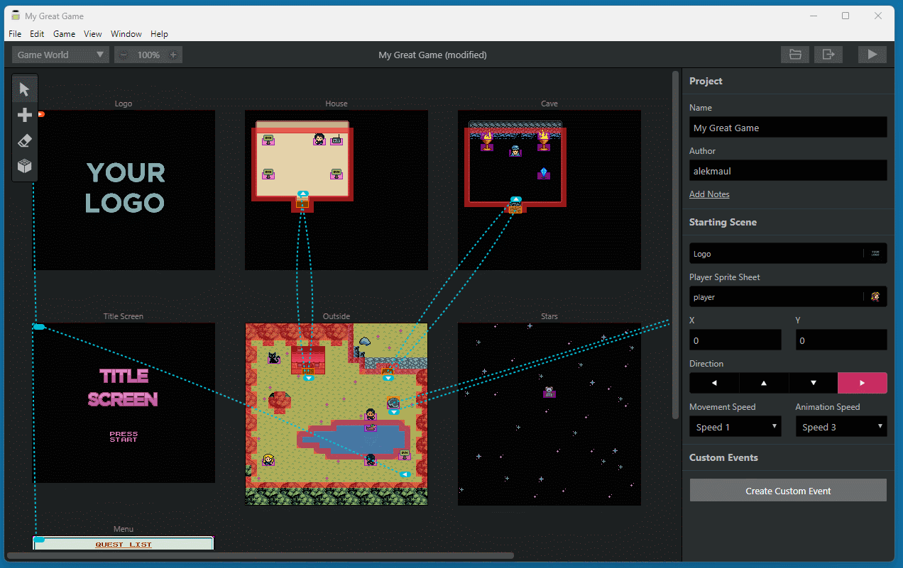

# GBSNES Studio

**GBSNES Studio** is a fork of **GB Studio 1.2.2** that adds a Super Nintendo
(PVSnesLib) build target alongside the original Game Boy one — a free and easy to
use retro adventure game creator for Game Boy and Super Nintendo, for Mac, Linux
and Windows.

Based on GB Studio, Copyright (c) 2020 Chris Maltby ([@maltby](https://www.twitter.com/maltby)),
released under the [MIT license](https://opensource.org/licenses/MIT).

----



GBSNES Studio consists of an [Electron](https://electronjs.org/) game-builder
application and two C game engines:

- **Game Boy** — [GBDK](http://gbdk.sourceforge.net/), music by
  [GBT Player](https://github.com/AntonioND/gbt-player)
- **Super Nintendo** — [PVSnesLib](https://github.com/alekmaul/pvsneslib), music
  and sound via snesmod

The Game Boy path is unchanged from GB Studio 1.2.2 and stays the reference; the
SNES target is added in parallel.

## Running from source

You need [Git](https://git-scm.com/) and Node.js 16 on your `PATH`. Then:

```bash
$ yarn
$ npm start
```

Package a distributable with `yarn make:win`, `yarn make:mac` or `yarn make:linux`.

## Documentation

- `appData/src/snes/README.md` — the SNES engine (architecture, milestones)
- `appData/src/snes/EVENTS.md` — per-event Game Boy vs SNES support
- `appData/src/snes/PERF.md` — SNES performance profile
- `CLAUDE.md` — repository guide (build pipeline, conventions)
- `CHANGELOG.md` — release notes
